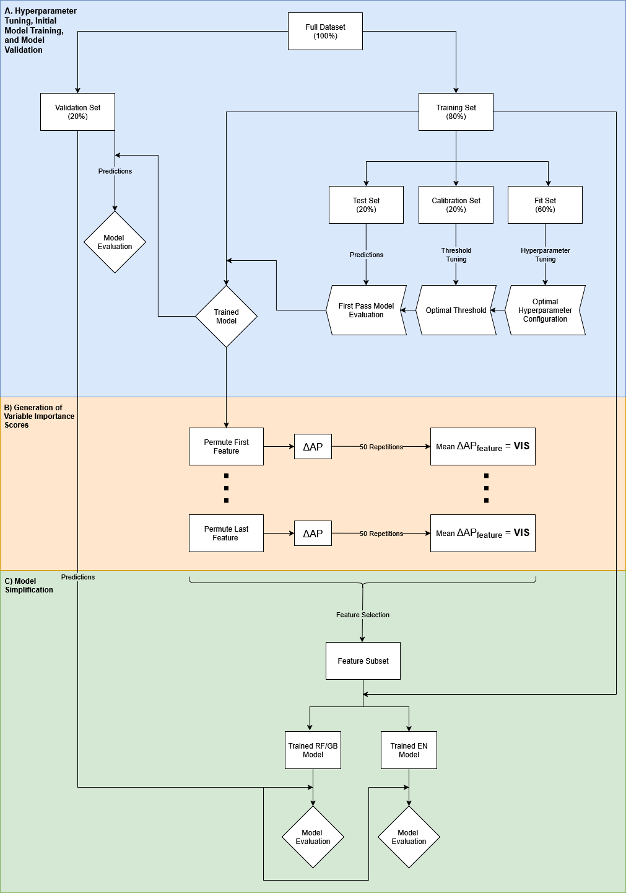

# Genomic Prediction Models from Variant Data Using Ensemble Machine Learning and Elastic Net

This repository contains workflows for building genomic prediction models from variant data in VCF format to classify a binary phenotype. The pipeline uses random forest and gradient boosting models trained on genome-wide variant features, followed by feature reduction based on feature importance. Elastic net regression provides an additional layer of feature selection and a more interpretable predictive model.

## Workflow Overview

This project was developed to support genomic prediction from sequencing-derived variant data using reproducible, workflow-based analyses. It includes preprocessing steps, model training and evaluation, feature reduction, and validation on an independent dataset. The repository is organized around end-to-end analysis rather than a single script, with separate components for preprocessing, random forest, gradient boosting, and elastic net modeling.

  

Workflow for model training, validation, and simplification across six models (RF and GB; STDB, TB, and combined-breed).

**A.** The full dataset is divided into training and validation sets. The training set is further split into a fit set (for hyperparameter tuning), a calibration set (for threshold selection), and a test set (for evaluating generalizability). After selecting optimal hyperparameters, the model is trained on the full training set and evaluated on the validation set.  

**B.** Variable importance scores (VIS) are obtained through permutation tests, defined as the mean change in average precision (AP) between the unpermuted and permuted models for each feature.  

**C.** Features are ranked by VIS, and variants contributing up to 80% of cumulative predictive power are retained. RF and GB models are retrained using the selected features and validated. An elastic net (EN) model is then trained on the union of RF- and GB-selected features from each cohort and validated.  

† Five-fold cross-validation.  
‡ Hyperparameter tuning repeated across five independently resampled fit sets (runs).

## Repository Structure

- `data_preprocessing/` — scripts and outputs for preparing training and validation datasets (note that the demo data outputs are in here on download)
- `random_forest/` — random forest training workflow (note that the demo data outputs are in here on download)
- `gradient_boosting/` — gradient boosting training workflow (note that the demo data outputs are in here on download)
- `elastic_net/` — elastic net modeling in R  
- `R_scripts/` — supporting R scripts for downstream analysis and interpretation  
- `demo_data/` — example input files  
- `conda_env.yaml` — conda environment for setup  
- `submit_data_preprocessing.slurm`, `slurm.RF` — example SLURM submission scripts  

## Methods Summary

The modeling strategy uses ensemble learning methods to capture predictive signal across genome-wide variant data. Random forest and gradient boosting models are trained first, and feature importance scores from those models can be used to create a reduced feature set. Elastic net is then used as an additional feature selection and modeling approach to produce a more interpretable predictive model.

## Installation

    git clone https://github.com/kdimmler2/Genomic_Prediction_RF_GB.git
    cd Genomic_Prediction_RF_GB
    conda env create -f conda_env.yaml
    conda activate Genomic_Prediction_RF_GB

## Input Data

### Required Inputs

- VCF file containing variant data with variant IDs (chr_pos_ref_alt)
- Phenotype file with sample IDs matching the VCF  
- Optional covariates  

Example phenotype format:

    0 HG00096 0

Columns:
1. Binary phenotype (0 or 1)  
2. Sample ID (must match VCF)  
3. Covariates (optional additional columns allowed)  

## Quick Start - Demo Data

### 1. Preprocess data
    cd data_preprocessing
    bash training_data.sh
    bash validation_data.sh

Outputs:
- `data_preprocessing/training_data/`  
- `data_preprocessing/validation_data/`  

---

### 2. Train models

Workflow stages:
1. Hyperparameter tuning  
2. Threshold tuning  
3. Test metrics  
4. Final training  

Example commands are in:

    random_forest/training/snakemake_commands.txt

---

### 3. Validate model

Apply trained model to validation dataset.  
Validation data must contain the same variants used during training.

---

### 4. Feature reduction

Rank features by importance and select top features (e.g., cumulative importance threshold ~80%).

---

### 5. Elastic net

Run elastic net models in R for additional feature selection and interpretability.

## Workflow Notes

Designed for reproducible analysis with support for HPC environments (SLURM).

## Example Use Case

[ADD: 2–4 sentences describing the biological problem you applied this to]

## Outputs

- Processed datasets  
- Trained models  
- Performance metrics  
- Feature importance rankings  
- Reduced feature sets  
- Validation predictions  

## Requirements / Environment

- Conda environment (`conda_env.yaml`)  
- HPC optional (SLURM scripts provided)  

## Limitations

- Validation dataset must contain training variants  
- Phenotype file must match VCF sample IDs  
- Currently designed for binary classification  

## Future Improvements

- Centralize configuration  
- Expand example commands
- Improve flow and accessability 

## Contact

Kirsten Dimmler
kirstendimmler@gmail.com
